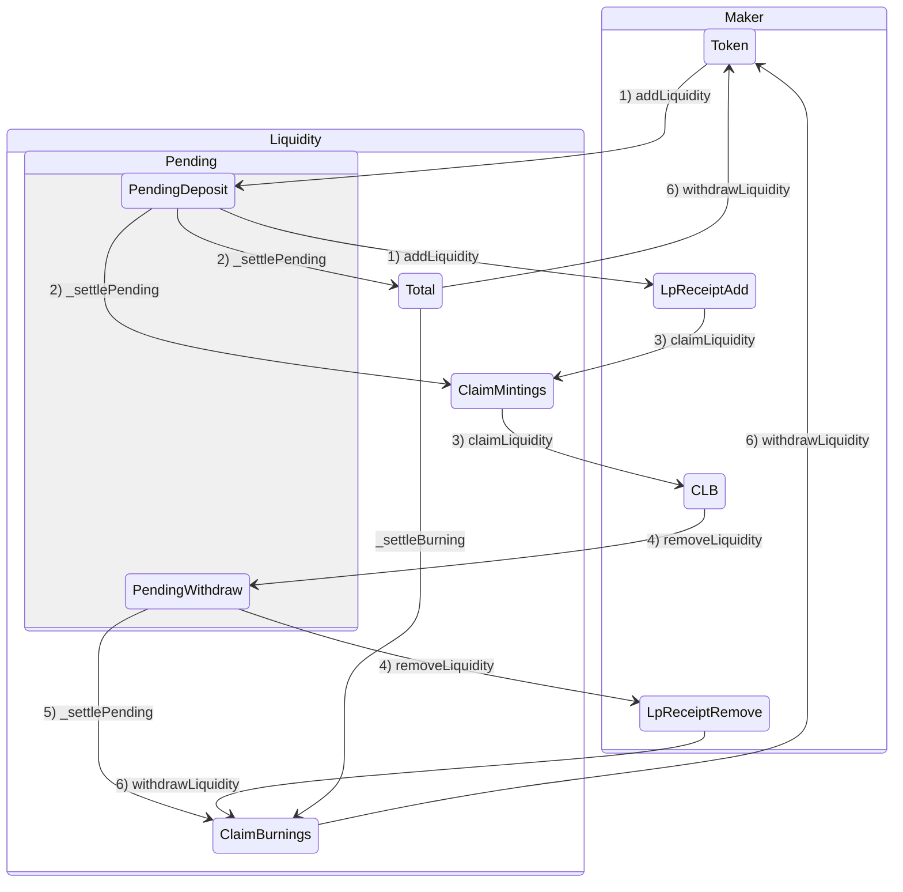

# Overview

## Maker
- [AddLiquidity](maker/AddLiquidity.md)
- [ClaimLiquidity](maker/ClaimLiquidity.md)
- [RemoveLiquidity](maker/RemoveLiquidity.md)
- [WithdrawLiquidity](maker/WithdrawLiquidity.md)

## Taker
- [OpenPosition](taker/OpenPosition.md)
- [ClosePosition](taker/ClosePosition.md)
- [ClaimPosition](taker/ClaimPosition.md)

## state
### liquidity related
```sol
/**
 * @dev Represents the liquidity information within an LiquidityBin.
 */
struct BinLiquidity {
    uint256 total;
    IMarketLiquidity.PendingLiquidity _pending;
    // oracleVersion to claimMinting
    mapping(uint256 => _ClaimMinting) _claimMintings;
    // oracleVersion to claimBuring
    mapping(uint256 => _ClaimBurning) _claimBurnings;
    DoubleEndedQueue.Bytes32Deque _burningVersions;
}

struct _ClaimMinting {
    uint256 tokenAmountRequested;
    uint256 clbTokenAmount;
}

struct _ClaimBurning {
    uint256 clbTokenAmountRequested;
    uint256 clbTokenAmount;
    uint256 tokenAmount;
}

// in IMarketLiquidity
struct PendingLiquidity {
    uint256 oracleVersion;
    uint256 mintingTokenAmountRequested;
    uint256 burningCLBTokenAmountRequested;
}

// LpReceipt
struct LpReceipt {
    uint256 id;
    uint256 oracleVersion;
    uint256 amount;  // settlement token or CLB token
    address recipient;
    LpAction action;  // ADD_LIQUIDITY or REMOVE_LIQUIDITY
    int16 tradingFeeRate;
}

```

### position related

```sol
// in BinPosition
struct BinPosition {
    int256 totalQty;
    uint256 totalEntryAmount;
    uint256 _totalMakerMargin;
    uint256 _totalTakerMargin;
    BinPendingPosition _pending;
    AccruedInterest _accruedInterest;
}

// in BinPendingPosition
struct BinPendingPosition {
    uint256 openVersion;
    int256 totalQty;
    uint256 totalMakerMargin;
    uint256 totalTakerMargin;
    AccruedInterest accruedInterest;
}

// in AccruedInterest
struct AccruedInterest {
    uint256 accumulatedAt;
    uint256 accumulatedAmount;
}

```

## BinLiquidity


