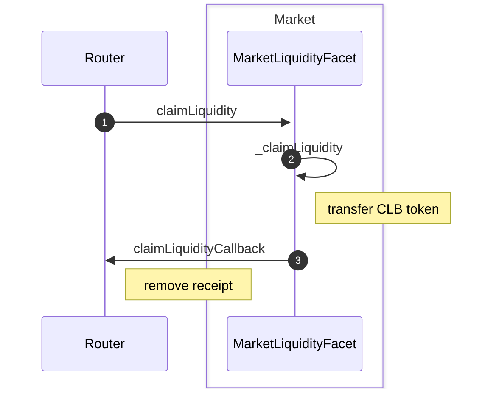
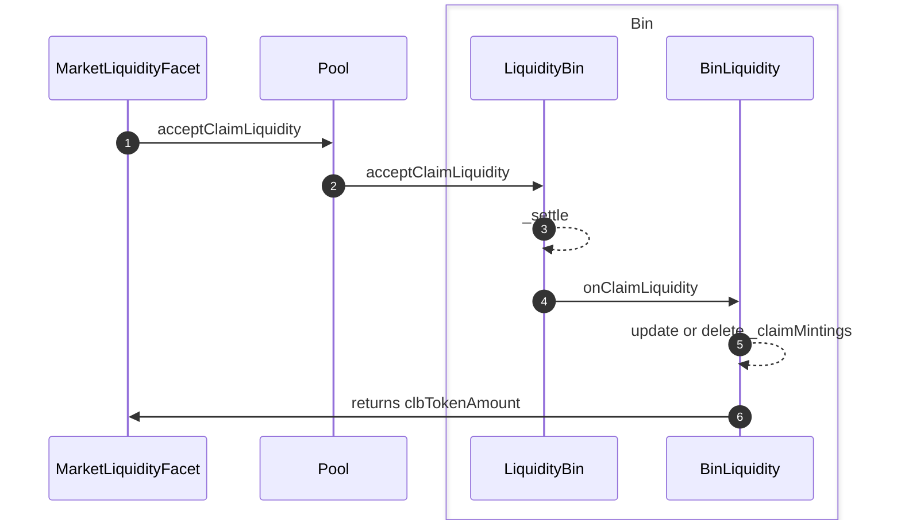
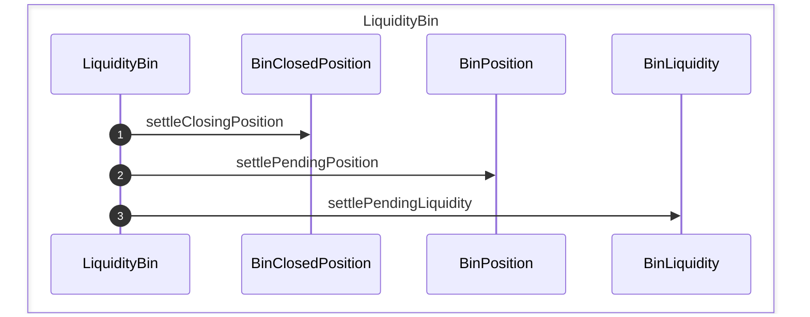
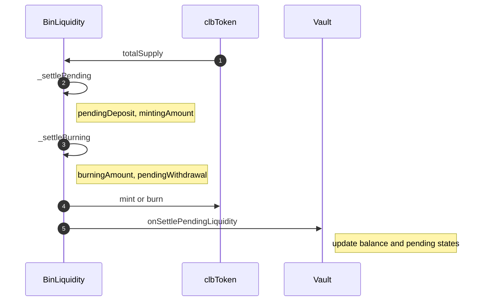

# ClaimLiquidity

## _claimLiquidity of MarketLiquidityFacet

## settle of LiquidityBin

## settlePendingLiquidity of BinLiquidity

`_settlePending`에서 oracleVersion이 업데이트 되었다면, addLiquidity에서 요청한 deposit의 CLB amount를 확정하고 liquidity `total` 증가, `claimMintings` 업데이트

