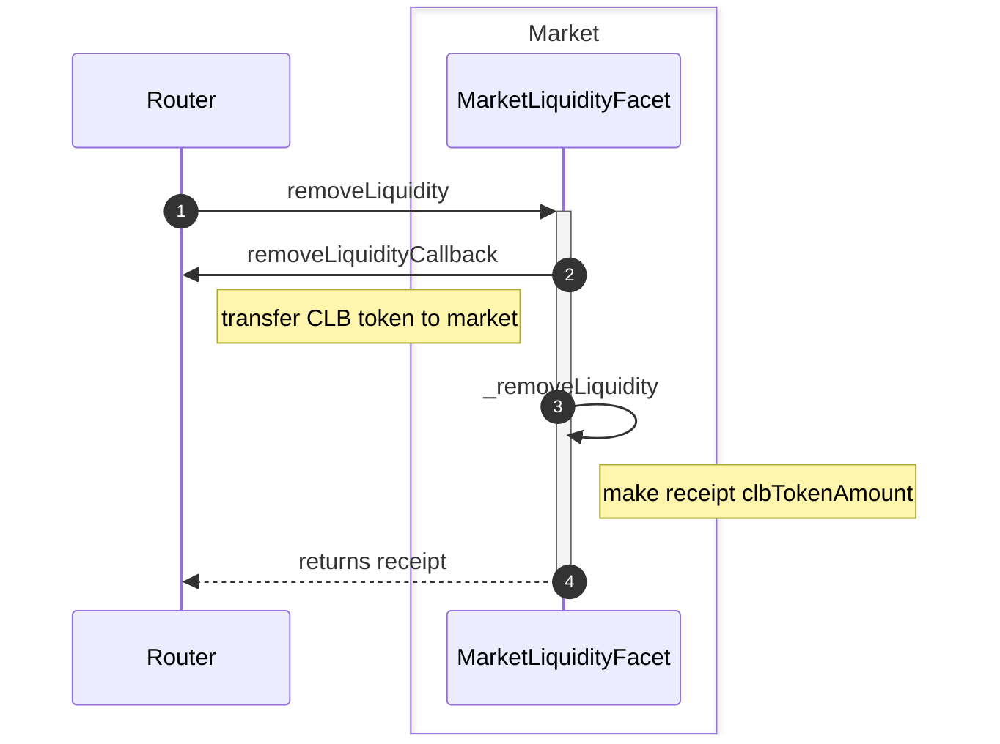
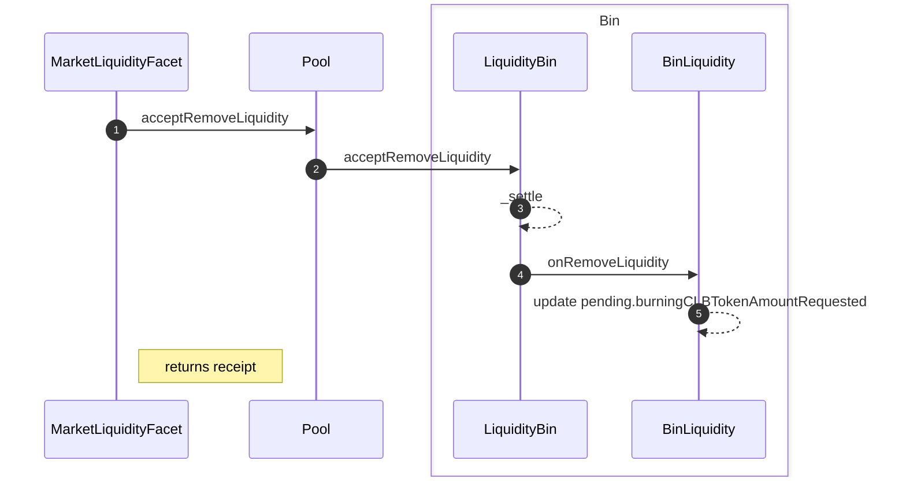
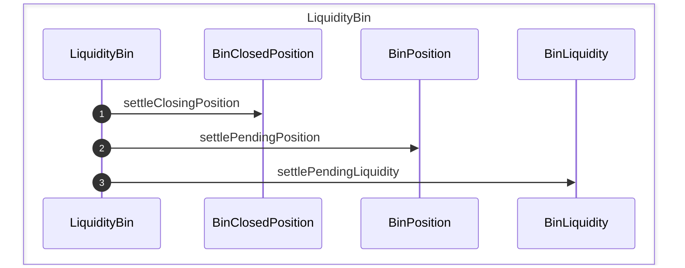
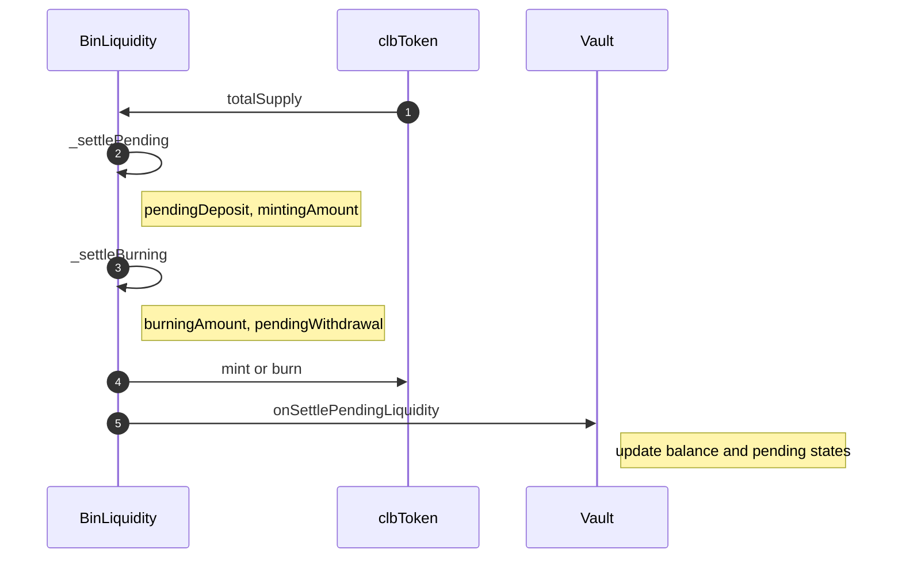

# RemoveLiquidity

```mermaid
sequenceDiagram
  autonumber
  participant R as Router
  box Market
  participant F as MarketLiquidityFacet
  end
  # participant V as Vault

  R->>+F: removeLiquidity
  F->>R: removeLiquidityCallback
  note right of R: transfer CLB token to market
  F->>F: _removeLiquidity
  note right of F: make receipt clbTokenAmount
  F-->>-R: returns receipt
```

## _removeLiquidity of MarketLiquidityFacet

```mermaid
sequenceDiagram
  autonumber
  participant F as MarketLiquidityFacet
  participant P as Pool
  
  box Bin
  participant B as LiquidityBin
  participant L as BinLiquidity
  end

  F->>P: acceptRemoveLiquidity
  P->>B: acceptRemoveLiquidity
  B-->>B: _settle
  B->>L: onRemoveLiquidity
  L-->>L: update pending.burningCLBTokenAmountRequested
  note right of F: returns receipt
```

## settle of LiquidityBin

```mermaid
sequenceDiagram
  autonumber
  box LiquidityBin
    participant B as LiquidityBin
    participant C as BinClosedPosition
    participant P as BinPosition
    participant L as BinLiquidity
  end
  B->>C: settleClosingPosition
  B->>P: settlePendingPosition
  B->>L: settlePendingLiquidity

```

## settlePendingLiquidity of BinLiquidity

```mermaid
sequenceDiagram
  autonumber
  participant L as BinLiquidity
  participant T as clbToken
  participant V as Vault

  T->>L: totalSupply
  L->>L: _settlePending
  Note right of L: pendingDeposit, mintingAmount
  
  L->>L: _settleBurning
  Note right of L: burningAmount, pendingWithdrawal

  L->>T: mint or burn
  L->>V: onSettlePendingLiquidity
  Note right of V: update balance and pending states
```
