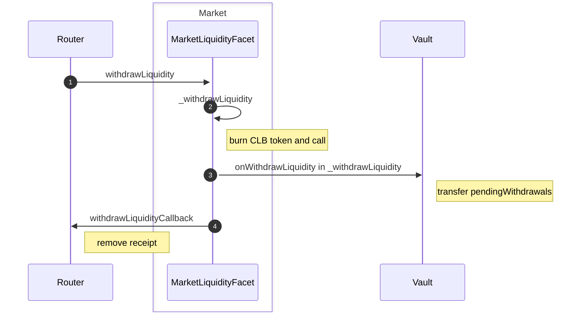
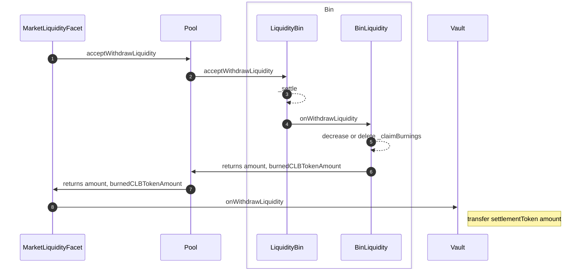
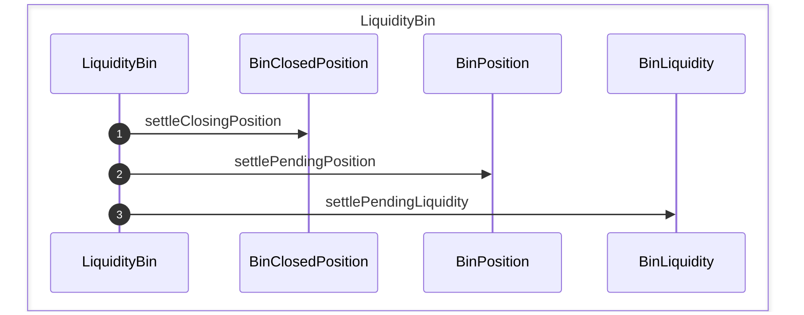
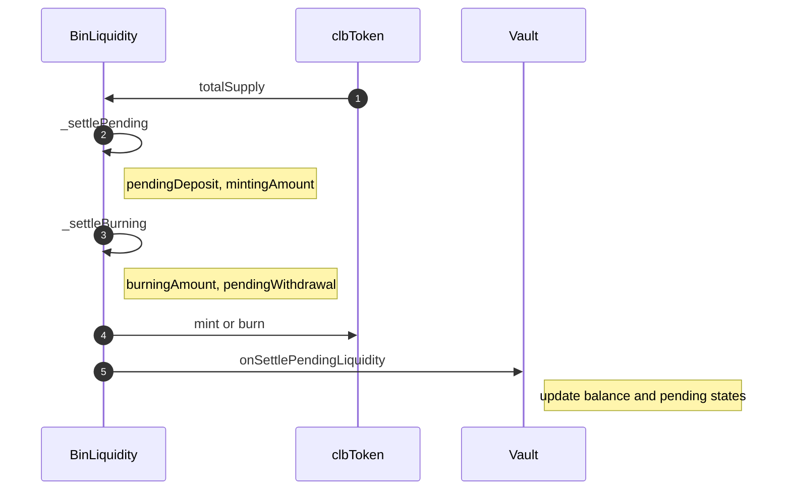

# WithdrawLiquidity

```mermaid
sequenceDiagram
  autonumber
  participant R as Router
  box Market
  participant F as MarketLiquidityFacet
  end
  participant V as Vault

  R->>+F: withdrawLiquidity
  F->>F: _withdrawLiquidity
  note right of F: burn CLB token and call 
  F->>V: onWithdrawLiquidity in _withdrawLiquidity
  note right of V: transfer pendingWithdrawals
  F->>R: withdrawLiquidityCallback
  note right of R: remove receipt 
```

## _withdrawLiquidity of MarketLiquidityFacet

```mermaid
sequenceDiagram
  autonumber
  participant F as MarketLiquidityFacet
  participant P as Pool
  
  box Bin
  participant B as LiquidityBin
  participant L as BinLiquidity
  end
  participant V as Vault

  F->>P: acceptWithdrawLiquidity
  P->>B: acceptWithdrawLiquidity
  B-->>B: _settle
  B->>L: onWithdrawLiquidity
  L-->>L: decrease or delete _claimBurnings
  L->>P: returns amount, burnedCLBTokenAmount
  P->>F: returns amount, burnedCLBTokenAmount
  F->>V: onWithdrawLiquidity
  note right of V: transfer settlementToken amount
```

## settle of LiquidityBin

```mermaid
sequenceDiagram
  autonumber
  box LiquidityBin
    participant B as LiquidityBin
    participant C as BinClosedPosition
    participant P as BinPosition
    participant L as BinLiquidity
  end
  B->>C: settleClosingPosition
  B->>P: settlePendingPosition
  B->>L: settlePendingLiquidity

```

## settlePendingLiquidity of BinLiquidity

```mermaid
sequenceDiagram
  autonumber
  participant L as BinLiquidity
  participant T as clbToken
  participant V as Vault

  T->>L: totalSupply
  L->>L: _settlePending
  Note right of L: pendingDeposit, mintingAmount
  
  L->>L: _settleBurning
  Note right of L: burningAmount, pendingWithdrawal

  L->>T: mint or burn
  L->>V: onSettlePendingLiquidity
  Note right of V: update balance and pending states
```
