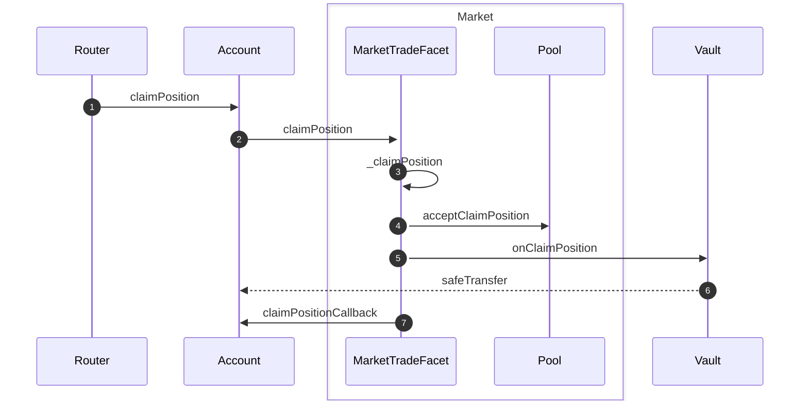
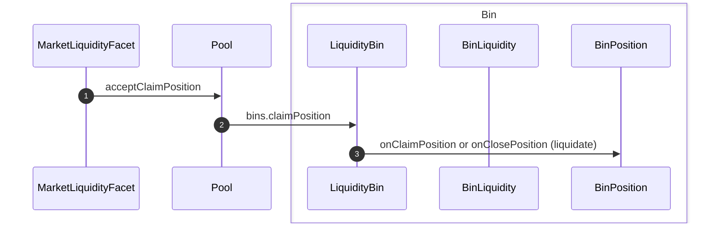
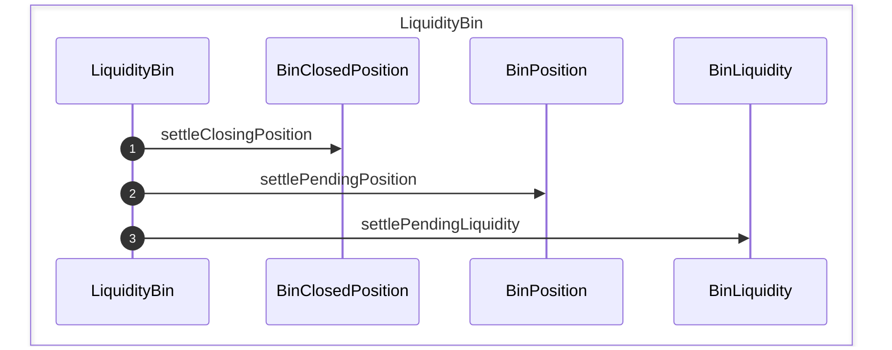

# ClaimPosition

```mermaid
sequenceDiagram
  autonumber
  participant R as Router
  participant A as Account
  box Market
  participant F as MarketTradeFacet
  participant P as Pool
  end
  participant V as Vault

  R->>A: claimPosition
  A->>+F: claimPosition
  F->>F: _claimPosition
  F->>P: acceptClaimPosition
  F->>V: onClaimPosition
  V-->>A: safeTransfer
  F->>A: claimPositionCallback
```

## acceptClaimPosition of Pool

```mermaid
sequenceDiagram
  autonumber
  participant F as MarketLiquidityFacet
  participant P as Pool
  
  box Bin
  participant B as LiquidityBin
  participant L as BinLiquidity
  participant BP as BinPosition
  end

  F->>P: acceptClaimPosition
  P->>B: bins.claimPosition
  B->>BP: onClaimPosition or onClosePosition (liquidate)
```

## settle of LiquidityBin

```mermaid
sequenceDiagram
  autonumber
  box LiquidityBin
    participant B as LiquidityBin
    participant C as BinClosedPosition
    participant P as BinPosition
    participant L as BinLiquidity
  end
  B->>C: settleClosingPosition
  B->>P: settlePendingPosition
  B->>L: settlePendingLiquidity

```

