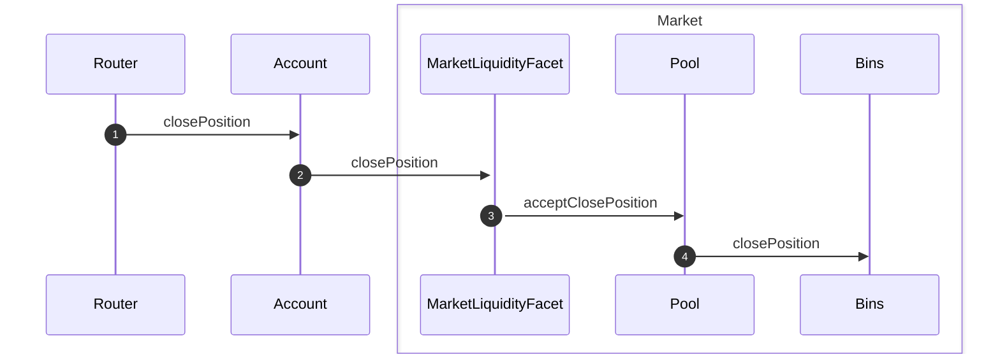
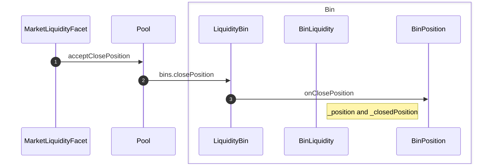
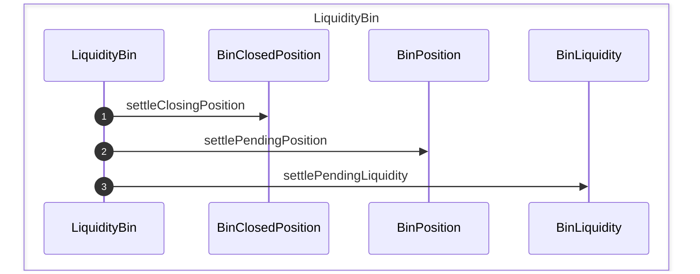

# ClosePosition

```mermaid
sequenceDiagram
  autonumber
  participant R as Router
  participant A as Account
  box Market
  participant F as MarketLiquidityFacet
  participant P as Pool
  participant B as Bins
  end

  R->>A: closePosition
  A->>+F: closePosition
  F->>P: acceptClosePosition 
  P->>B: closePosition
```

## acceptClosePosition of Pool

```mermaid
sequenceDiagram
  autonumber
  participant F as MarketLiquidityFacet
  participant P as Pool
  
  box Bin
  participant B as LiquidityBin
  participant L as BinLiquidity
  participant BP as BinPosition
  end

  F->>P: acceptClosePosition
  P->>B: bins.closePosition
  B->>BP: onClosePosition
  note left of BP: _position and _closedPosition
```

## settle of LiquidityBin

```mermaid
sequenceDiagram
  autonumber
  box LiquidityBin
    participant B as LiquidityBin
    participant C as BinClosedPosition
    participant P as BinPosition
    participant L as BinLiquidity
  end
  B->>C: settleClosingPosition
  B->>P: settlePendingPosition
  B->>L: settlePendingLiquidity

```
