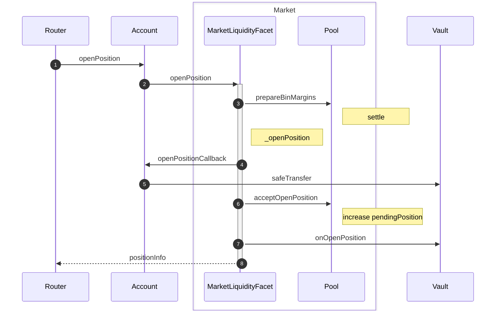
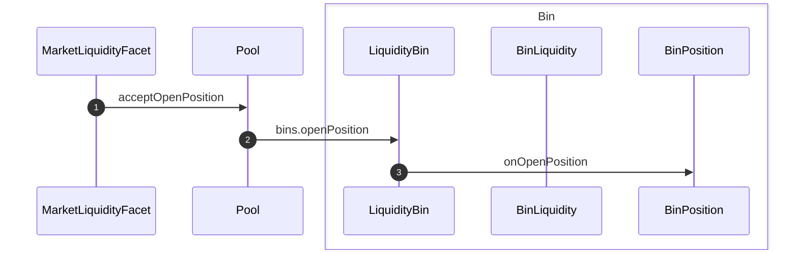
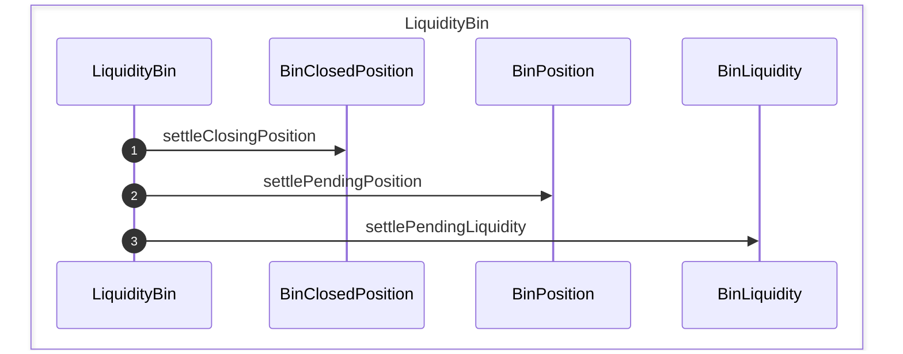

# OpenPosition

```mermaid
sequenceDiagram
  autonumber
  participant R as Router
  participant A as Account
  box Market
  participant F as MarketLiquidityFacet
  participant P as Pool
  end
  participant V as Vault

  R->>A: openPosition
  A->>+F: openPosition
  F->>P: prepareBinMargins 
  note right of P: settle
  note right of F: _openPosition
  F->>A: openPositionCallback
  A->>V: safeTransfer
  F->>P: acceptOpenPosition
  note right of P: increase pendingPosition
  F->>V: onOpenPosition

  F-->>-R: positionInfo
```

## acceptOpenPosition of Pool

```mermaid
sequenceDiagram
  autonumber
  participant F as MarketLiquidityFacet
  participant P as Pool
  
  box Bin
  participant B as LiquidityBin
  participant L as BinLiquidity
  participant BP as BinPosition
  end

  F->>P: acceptOpenPosition
  P->>B: bins.openPosition
  B->>BP: onOpenPosition
```

## settle of LiquidityBin

```mermaid
sequenceDiagram
  autonumber
  box LiquidityBin
    participant B as LiquidityBin
    participant C as BinClosedPosition
    participant P as BinPosition
    participant L as BinLiquidity
  end
  B->>C: settleClosingPosition
  B->>P: settlePendingPosition
  B->>L: settlePendingLiquidity

```
