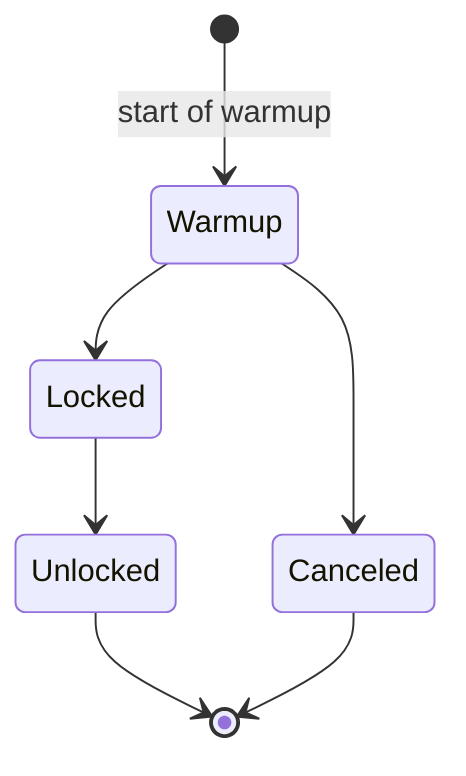
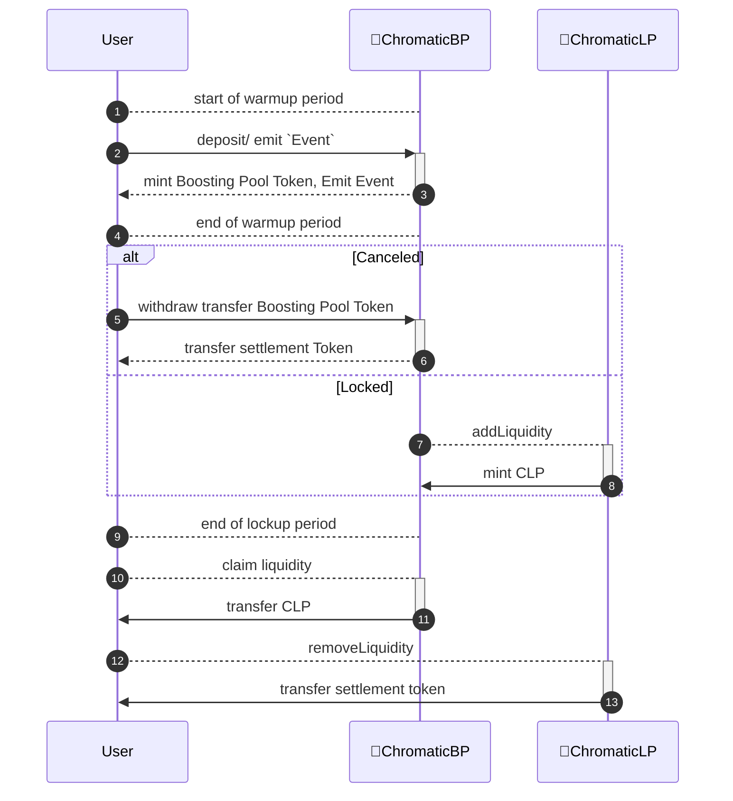

# BP (LP Boosting Pool) contract

BP (Boosting Pool) is a contract for LP recruitment and reward programs, offering the following features:

- During the Liquidity Warmup Period, depositing funds incurs a penalty in the form of a lockup during the Liquidity Boosting Period.
  - The lockup period restricts the removal of liquidity.
  
- LP recruitment program executing a lockup penalty during the Liquidity Boosting Period.
  - Participants receive reward points exchangeable for CHRMA tokens.
  - CHRMA token exchange is an off-chain operation beyond the scope of this document.

- Deposits to the pool and received tokens are __non-transferable__.
  - Reward aggregation is an off-chain operation.
  - Aggregation is based on the wallet used for the deposit.
  - When the pool is 'locked,' reward aggregation is calculated using a quadratic function.

- Target Amount:
  - Maximum amount: Any excess beyond the target is not allowed.
  - Minimum amount: If the minimum is not exceeded, boosting is canceled, and funds can be refunded to users.

## LP Boosting and Lockup Period Activation

During the warm-up period, if the maximum amount is deposited, the warm-up period concludes, and LP boosting is initiated. Following this, the lockup period begins.

### Description

1. **Warm-Up Period:**
   - Users can deposit funds during the warm-up period.
   - If the maximum allowable amount is reached, the warm-up period concludes.

2. **LP Boosting Initiation:**
   - Upon reaching the maximum deposit amount during the warm-up period, LP boosting is triggered.

3. **Lockup Period Activation:**
   - Following the initiation of LP boosting, the lockup period begins.

## Timeline
- startof liquidity warmup period
  - state: `warmup`, Users are able to call `deposit`  
- end of liquidity warmup period
  - = startOf liquidity boosting period
  - state: `canceled` if warmup period ends without reaching the minimum target amount. Users are able to call `refund`  
  - state: `locked`
- end of liquidity boosting period
  - state: `unlocked`, Users are able to call `claim`

## contract interation and state

## Warmup period
- Deposit is allowed and can be done multiple times.
- Withdrawal is not permitted.
- Maximum Cap:
  - Additional deposits are not allowed if the total max cap is exceeded.

## canceled
- In case the minimum cap is not met:
  - Cancel the operation.
  - Return the funds:
    - Allow for a refund, each participant receiving their respective amount.

## locked
- In case the minimum cap is exceeded:
  - Provide liquidity to the pool using `addLiquidity`.
    - Transaction execution is handled by the Chromatic development team or Automation can be considered.
- The boosting pool holds CLP during lock-up period.

## unlock

- Depending on the deposited ratio:
  - Withdraw CLP, each receiving their respective tokens.
    - Note: Rewards are credited to the wallet at the time of deposit, but during CLP withdrawal, they are distributed to the owner of the boosting pool's tokens.
