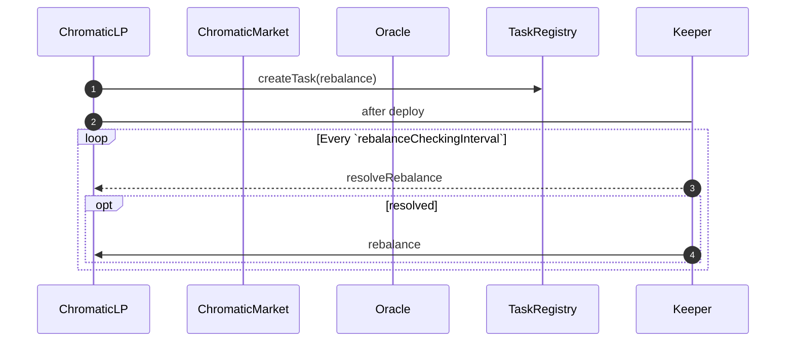
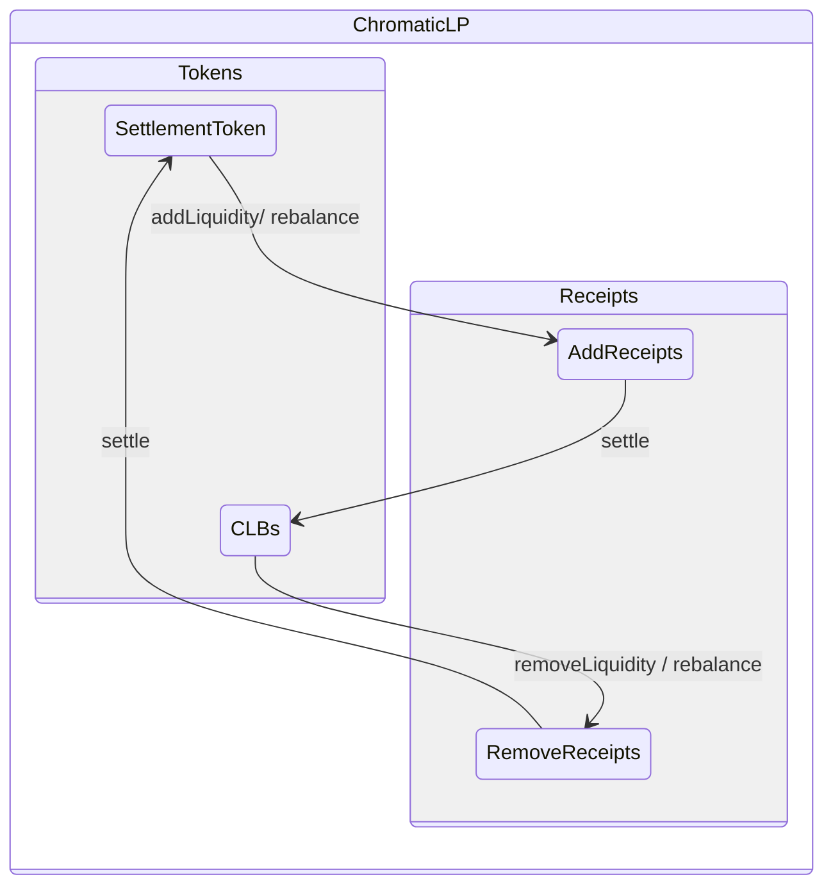
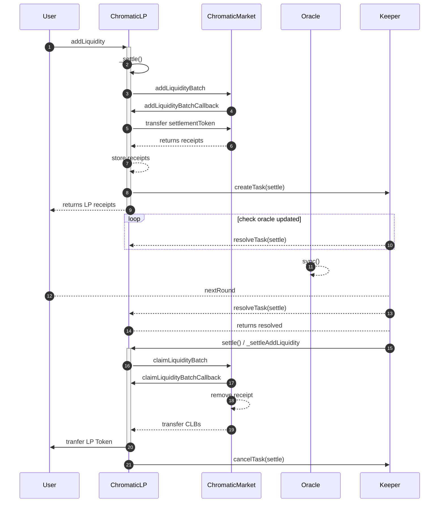
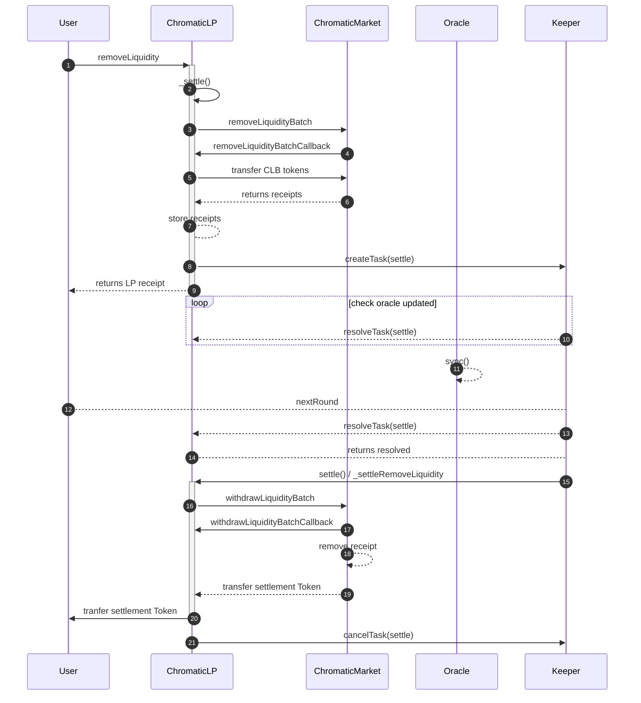
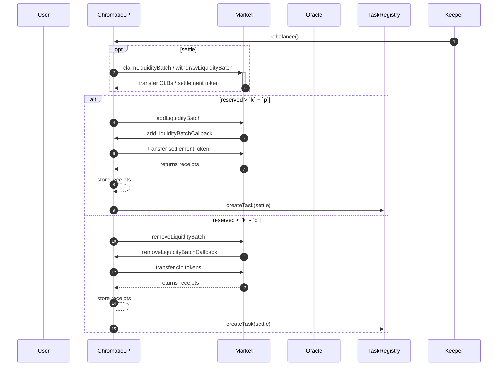
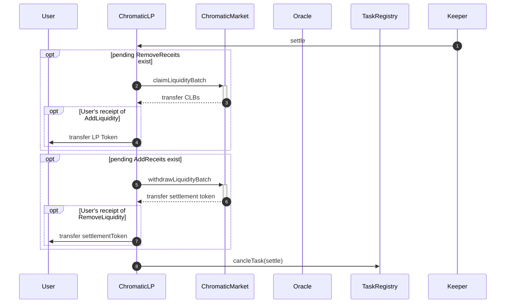

# Simple Reference LP (liquidity provider)

## Overview
A single Liquidity Provider (LP) is a vehicle that provides and manages liquidity across multiple bins of a target market, implementing the maker's strategy.
- In other words, it provides a strategy for supplying liquidity to multiple liquidity bins of a market.
- It executes a strategy of adjusting fund allocation ratios through `rebalancing` by the keeper.
- The target of the LP's maker strategy is a single market, meaning
  - LP:market = 1:1
  - market:LP = 1:N
- Minting/burning of ERC20 tokens is executed when providing/retrieving liquidity to/from the LP.

## Operational Mechanism
- Maintain the target liquidity supply ratio.
  - `utilizationTargetBPS`: `0 ~ 10000`
  - Immutable.
- Distribution ratios for each bin.
  - `distributionRates`: `sum(distributionRates) = totalRate`
  - Up to 72 distribution ratios for each bin.
  - Ratios will change due to PNL, and no rebalancing is done to match these ratios.
- Periodically check rebalancing using the keeper based on rebalancing conditions.
  - `rebalanceCheckingInterval`: Rebalancing execution interval.
    - Immutable.

## overview

### creating

- Register the `rebalance` task to be executed at the configured intervals (`t`) upon LP creation in the task registry of Automation framework (for example Gelato).

### ChromaticLPRegistry 
- To supply liquidity to a market, users should be able to query LPs dedicated to liquidity provision for specific markets.

### ChromaticLP

#### addLiquidity

#### removeLiquidity

#### rebalancing

#### settle

